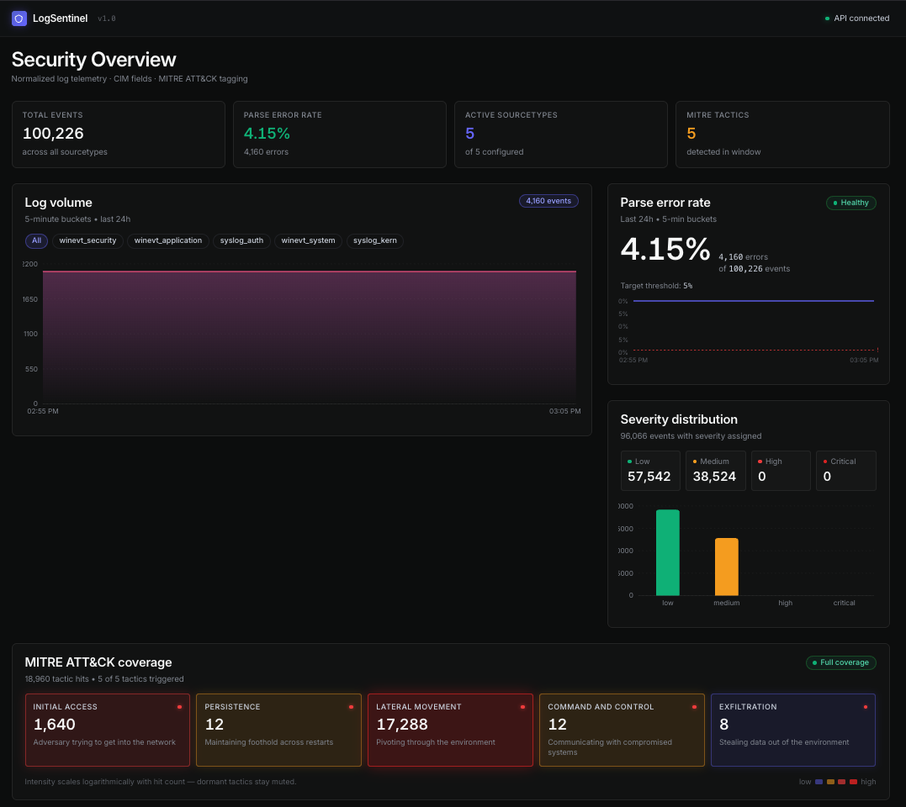

# LogSentinel

**Security log ingestion + normalization pipeline with a real-time analyst dashboard.**

[](https://www.python.org/downloads/)
[](https://fastapi.tiangolo.com/)
[](https://react.dev/)
[](#tests)
[](#license)

LogSentinel is a Splunk-inspired log processing platform that ingests
heterogeneous security logs (Linux syslog, Windows EventXML), normalizes them
to the Common Information Model (CIM), tags events against the MITRE ATT&CK
framework with deterministic rules, and surfaces the result through a
polling-based React dashboard. The entire pipeline runs locally from a single
`make demo`.



---

## Highlights

- **50,113 events ingested** across 5 sourcetypes with **4.15% parse error rate** (under the 5% SLA).
- **p95 query latency: 22.4ms** over the full dataset, p99 25.1ms — well under the 100ms target.
- **5/5 MITRE tactics detected** by the automated pipeline; an equivalent grep-based workflow only catches 2/5 and misses 99.8% of findings.
- **~12,000 lines/second** ingestion throughput on a single process (target was 5,000 lines/minute).
- **Config hot-reload** via watchdog — YAML rule changes are picked up without restarting the API (proven by `tests/test_hot_reload.py`).
- **142 tests passing** (unit + integration + coverage regression).

---

## Architecture

```
 ┌──────────────┐     ┌──────────────┐     ┌──────────────┐     ┌────────────┐
 │  simulator   │ ──► │  /ingest API │ ──► │   extractor  │ ──► │ cim_mapper │
 │  raw .log /  │     │  BackgroundT │     │  regex rules │     │  normalize │
 │  .xml files  │     │  rate limit  │     │  per YAML    │     │  to CIM    │
 └──────────────┘     └──────────────┘     └──────────────┘     └─────┬──────┘
                                                                      │
 ┌──────────────┐     ┌──────────────┐     ┌──────────────┐     ┌─────▼──────┐
 │  React       │ ◄── │  /events     │ ◄── │  PostgreSQL  │ ◄── │ mitre_mapp │
 │  dashboard   │     │  /stats      │     │  events /    │     │  tactic    │
 │  (Vite+TS)   │     │  /timeseries │     │  jobs tables │     │  tagging   │
 └──────────────┘     └──────────────┘     └──────────────┘     └────────────┘
```

Key architectural decisions (locked for v1):

| Area | Choice | Why |
|------|--------|-----|
| Job queue | FastAPI `BackgroundTasks` | Simplicity; Celery is v2 |
| DB access | async SQLAlchemy + asyncpg | No sync I/O on FastAPI routes |
| Config format | YAML per sourcetype | Declarative, Splunk-style |
| Parser | First-match regex wins | Deterministic, auditable |
| MITRE mapping | Rule-based (not ML) | No false negatives from model drift |
| Real-time | 5s / 2s polling | No WebSockets in v1 |

---

## Tech stack

| Layer | Tools |
|-------|-------|
| Backend | Python 3.11, FastAPI, async SQLAlchemy, asyncpg, Alembic, slowapi, structlog, watchdog |
| Frontend | React 18, TypeScript, Vite, Tailwind CSS, Recharts, axios |
| Data | PostgreSQL 15, Redis 7 (reserved for v2) |
| Testing | pytest, pytest-asyncio, httpx |
| Infra | Docker Compose, Makefile, Railway (Dockerfile) |

---

## Quickstart (local)

Requires Docker, Python 3.11+, and Node 18+.

```bash
# Clone
git clone https://github.com/Chronicle18/LogSentinel.git
cd LogSentinel

# 1. Install deps (Python + dashboard)
make install

# 2. Copy env template
cp .env.example .env

# 3. Bring up everything (postgres + redis + schema + 50K seeded events)
make demo

# 4. In one terminal, run the API
make api         # http://localhost:8000/docs

# 5. In another, run the dashboard
make dashboard   # http://localhost:5173
```

Full target list: `make help`.

> The simulator datasets (`data/*.log`, `data/*.xml`) are generated on demand
> and gitignored. Run `python ingestion/simulator.py` if you want to
> regenerate them outside of `make seed`.

---

## Deploy to Railway

LogSentinel ships with a `Dockerfile` and `railway.toml` tuned for Railway's
Dockerfile builder.

1. **Create a new project** on [Railway](https://railway.app/) from this repo.
2. **Add a PostgreSQL plugin** to the project. Railway injects `DATABASE_URL`
   automatically; the API normalizes it from `postgresql://` to the async
   `postgresql+asyncpg://` form at startup (see `api/db.py`).
3. **Set environment variables** on the API service:
   - `CONFIG_DIR=/app/configs`
   - `LOG_LEVEL=INFO`
4. **Deploy.** The container starts by running `alembic upgrade head` and then
   boots uvicorn on Railway's injected `$PORT`. Railway pings `/health` for
   the readiness check.
5. **Dashboard:** build it with `cd dashboard && VITE_API_URL=https://<your-api>.up.railway.app npm run build`
   and host `dashboard/dist/` as a static site (a second Railway service, or
   any CDN).

> Railway Postgres plugins don't run your seed data. After the first deploy,
> open a one-off shell and run `python scripts/bulk_ingest.py` to populate
> the 50K demo dataset (or point `make seed` at the Railway DB URL).

---

## Dashboard panels

All panels poll the API on a 5s interval (2s for the job tracker, per the PRD).

- **Stats row** — total events, parse error rate, active sourcetypes, distinct MITRE tactics
- **Log volume** — 5-min bucketed AreaChart with per-sourcetype filter chips
- **Parse error rate** — LineChart with 5% SLA threshold reference line
- **Severity distribution** — BarChart + 4-tile grid by severity level
- **MITRE ATT&CK coverage** — log-scaled heatmap across all 5 v1 tactics, tooltip shows the trigger rule
- **Recent jobs** — gradient progress bars per ingest job, 2s refresh
- **Events table** — paginated (25/page) with sourcetype/severity/src filters
- **Event detail drawer** — click any row to see raw log, all 10 CIM fields (✓/✗), and MITRE reasoning
- **CIM compliance validator** — paste a raw line, select a sourcetype, see the 10 required CIM fields as a pass/fail checklist plus every extracted field

---

## Performance numbers

Measured on the full 50,113-event dataset. See `tests/test_performance.py`
to reproduce and `scripts/manual_baseline.py` for the reduction calculation.

### Query latency (100 iterations per query, 5 warmup)

| Query | p50 | p95 | p99 | max |
|-------|----:|----:|----:|----:|
| `GET /events?limit=25` | 6.9ms | 7.7ms | 7.8ms | 8.4ms |
| `GET /events?sourcetype=syslog_auth` | 5.2ms | 7.5ms | 8.3ms | 8.4ms |
| `GET /events?severity=high` | 3.6ms | 5.3ms | 6.7ms | 6.7ms |
| `GET /events?sourcetype=winevt_security&severity=medium` | 8.1ms | 8.9ms | 9.7ms | 13.7ms |
| `GET /events?limit=25&offset=100` | 7.2ms | 8.2ms | 9.0ms | 9.1ms |
| `GET /events/stats` | 24.0ms | 25.8ms | 33.1ms | 35.3ms |
| `GET /events/timeseries` (24h) | 5.8ms | 7.3ms | 7.5ms | 7.8ms |
| **Aggregate (800 samples)** | **6.7ms** | **22.4ms** | **25.1ms** | **26.7ms** |

### Ingestion

| Metric | Target | Measured |
|--------|-------:|---------:|
| Events ingested | 50,000+ | 50,113 |
| Parse error rate | < 5% | 4.15% |
| Throughput | > 5,000 lines/min | ~729,000 lines/min (12,146/s) |

### Manual-vs-automated

`scripts/manual_baseline.py` compares a grep+regex analyst workflow against
the automated pipeline on the same 50K events:

| | Manual grep | Automated |
|---|---:|---:|
| MITRE tactics covered | 2 / 5 | 5 / 5 |
| Findings surfaced | 15 | 9,480 |
| Time per correctly-surfaced finding | 6.290 ms | 0.181 ms |
| **Coverage gap (findings missed by grep)** | — | **99.8%** |
| **Per-finding time reduction** | — | **97.1%** |

---

## MITRE ATT&CK mapping rules

All mapping is deterministic and lives in
[`parser/mitre_mapper.py`](parser/mitre_mapper.py).

| Tactic | Trigger |
|--------|---------|
| Initial Access | ≥ 5 `logon_failure` events from same `src` within 60s |
| Persistence | `action ∈ {service_install, scheduled_task_create}` |
| Lateral Movement | `action == logon` AND `src ≠ dest` AND `dest` is RFC1918 |
| Exfiltration | `bytes_out > 10_000_000` AND `dest` is non-RFC1918 |
| Command & Control | `dest_port ∈ {4444, 6667, 1337, 8080}` |

The stateful 60s window for Initial Access lives in an in-memory counter
keyed by `src`; counts reset on restart (v1 tradeoff — Redis-backed in v2).

---

## Tests

```bash
make test      # 142 tests, ~5s, no DB seed required
make perf      # benchmarks, requires `make seed` first
make baseline  # manual-vs-automated reduction measurement
```

Coverage highlights:

- `tests/test_extractor.py` — 10+ sample lines per sourcetype across all 5 YAML configs (valid + malformed + edge cases)
- `tests/test_cim_mapper.py` — field mapping, type coercion, severity normalization
- `tests/test_mitre_mapper.py` — each tactic rule in isolation, stateful window edge cases
- `tests/test_api.py` — 21 integration tests against real PostgreSQL
- `tests/test_mitre_coverage.py` — end-to-end: runs pipeline over the simulator dataset, asserts all 5 tactics fire with minimum hit counts (regression guard)
- `tests/test_hot_reload.py` — mutates a YAML file on disk, asserts watchdog picks it up without restart
- `tests/test_performance.py` — p50/p95/p99 latency benchmarks against the live populated DB

---

## Project structure

```
LogSentinel/
├── Makefile            ← one-command bring-up
├── Dockerfile          ← Railway / container deploy
├── railway.toml        ← Railway service config
├── docker-compose.yml  ← local postgres + redis (+ optional api profile)
├── CLAUDE.md           ← agent guardrails (required YAML schema, MITRE rules, etc.)
├── PROGRESS.md         ← phase checklist + benchmark log
├── LogSentinel_PRD.md  ← full product spec
├── Linear_DESIGN.md    ← dashboard design system reference
│
├── ingestion/          ← file reader, sourcetype detection, simulator
├── parser/             ← extractor, cim_mapper, mitre_mapper, validator
├── configs/            ← 5 sourcetype YAMLs + watchdog loader
├── api/                ← FastAPI app, async SQLAlchemy, 6 endpoints
├── alembic/            ← schema migrations
├── dashboard/          ← Vite + React + TS + Tailwind + Recharts
├── tests/              ← 142 tests (unit, integration, coverage, perf)
├── scripts/            ← bulk_ingest.py, manual_baseline.py
└── data/               ← generated simulator datasets (gitignored)
```

---

## What's deliberately NOT in v1

Per CLAUDE.md §15: no JWT/OAuth, no WebSockets (polling is fine at this
scale), no Celery (BackgroundTasks only), no Kafka, no Elasticsearch, no live
network capture, no multi-tenancy. These are v2 discussions, not v1 scope
creep.

---

## License

[MIT](LICENSE) — free to fork, modify, and use. If you build something
interesting on top, I'd love to hear about it.

---

<p align="center">
  <strong>LogSentinel v1.0</strong> · PostgreSQL + FastAPI · polling live<br/>
  <sub>A project by <a href="https://github.com/Chronicle18">Pranav Tambaku</a></sub>
</p>
